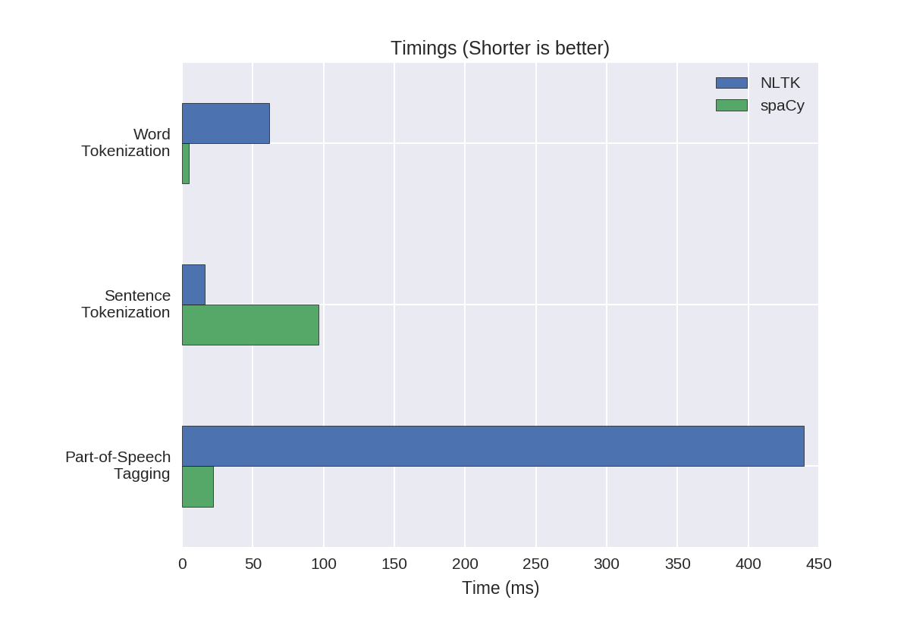

# The Problem

```
Generate a Concordance 

Given an arbitrary text document written in English, write a program that will generate 
a concordance, i.e. an alphabetical list of all word occurrences, labeled with word 
frequencies. Bonus: label each word with the sentence numbers in which each occurrence appeared. 

Sample Output:
a. a                        {2:1,1}
b. all                      {1:1}
c. alphabetical             {1:1}
d. an                       {2:1,1}
e. appeared                 {1:2}
f. arbitrary                {1:1}
g. bonus                    {1:2}
h. concordance              {1:1}
i. document                 {1:1}
j. each                     {2:2,2}
k. english                  {1:1}
l. frequencies              {1:1}
m. generate                 {1:1}
n. given                    {1:1}
o. i.e.                     {1:1}
p. in                       {2:1,2}
q. label                    {1:2}
r. labeled                  {1:1}
s. list                     {1:1}
t. numbers                  {1:2}
u. occurrence               {1:2}
v. occurrences              {1:1}
w. of                       {1:1}
x. program                  {1:1}
y. sentence                 {1:2}
z. text                     {1:1}
aa. that                    {1:1}
bb. the                     {1:2}
cc. which                   {1:2}
dd. will                    {1:1}
ee. with                    {2:1,2}
ff. word                    {3:1,1,2}
gg. write                   {1:1}
hh. written                 {1:1}
```


# Getting Set Up

1. Install rabbitmq server - see http://www.rabbitmq.com/
2. Install virtualenv and run a virtual environment with python 3.6-- optional, but helpful
3. Install python requirements

```sh
$ pip install -r requirements.txt
```

4. Start rabbitmq server
5. Start a few workers, background them with nohup or run them in the terminal to see output and progress
```sh
$ python add_data_worker.py
```
6. Start the concordance program, supply input filename and output filename
```sh
$ python concordance.py tests/test1.txt output.txt
```

7.  When the concordance program is done running, it will print success.  Check out the output file to see the generated content.


# Bragging Rights
On a low memory machine, this concordance generator was able to produce a concordance for a 350 page book in under a minute!


# How we solved it

This problem may appear trivial on the surface, and it is for small inputs.  But imagine when the input gets
very large -- say the Encyclopedia Britanica.  By taking the approach we did, we made it so this program can 
handle large documents, but it also slows down the process for smaller documents - namely because the process
of loading libraries like pika, and passing messages slows things down.

## Using spaCy

There are many choices for natural language processing.  NLTK is a popular one, as is spaCy.  We went with spacy for its speed benefits over NLTK, pictured below.



NOTE: Natural language processors make different decisions about contractions.  Both spaCy and NLTK choose
to handle contractions as multiple words, because contractions are really, two words.  We have chosen to 
follow that lead.

## Using SQLite 

In order to handle this problem efficiently for any size input, one data structure that comes to mind is the 
Binary Tree.  By using an optimization that keeps our tree balanced, like Red and Black trees, we can keep
our information in alphabetical order as we add to it, avoiding costly sorting later. Java has a built in 
TreeMap which would be exactly what we need, save for one thing.  The cost of storing the Encyclopedia in
memory would be high, and on lots of computers, impossible.

In order to deal with the problem, we make use of SQLite, a file that acts as a database.  It features quick
read, write, and lookup times and uses a binary tree on indexed values.  We create a database, add our values,
and only right before printing, add our index (adding an index at the beginning increases write times).


## Creating a distributed system

After solving the memory problems associated with large inputs we now have speed to consider again. Because of our smart choices as far as our algorithms are considered, even decent sized documents can be produce a
concordance pretty quickly.  That said, what about HUGE documents?

In order to deal with documents of any size, it makes sense that separate workers could handle the time intensive task of using spaCy to tokenize words and sentences. Just one problem though - we still need to keep
track of sentence numbers.  By dividing our file into a set number of smaller files, and remembering the order
of the files, we can have workers write to separate databases for each file chunk (sqlite does not support
multiple db connections), and then combine our databases in a way that preserves this information.  Yay.

By using a message passing system (rabbitmq) we allow our workers to potentially live in different places from
one another.  We also allow ourselves to "infinitely" scale.  In reality, we are currently inhibited by the 
number 10, the number of databases sqlite allows you to attach to a database.  If 10 was ever not enough,
moving off of sqlite to a production database would be the correct move. For now though, SQLite has the advantage of ease.

## Testing and the future

In order to improve this project, rigorous testing is needed.  The test plan includes integration tests
comparing output to a much greater number of concordances known to be properly formatted.  It also
includes unit test for all custom methods.

If this program were used in production, some things could be changed to make it more user friendly, for
example,

	- the alphabetical line numbers in the concordance become unreadable very quickly for large input 
	files.  Perhaps integers would be more intuitive.

	- running rabbitmq and a set of add_data_workers on a centralized server would allow easier distribution of the program, and a smaller install and setup process for end users.

	- Continuous Integration could be set up with a proper Python PEP 8 linter, and unit and integration
	tests that must run before any build is pushed into production.

	- Better logging, including shipping logs to logstash and using the ELK stack or another tool to monitor
	program logs.

	- A refactor that includes removing misleading variable names like NUMBER_OF_THREADS (which are remnants 
	of the programs past), as well as creating doc strings that allow for automatically generated documentation.


